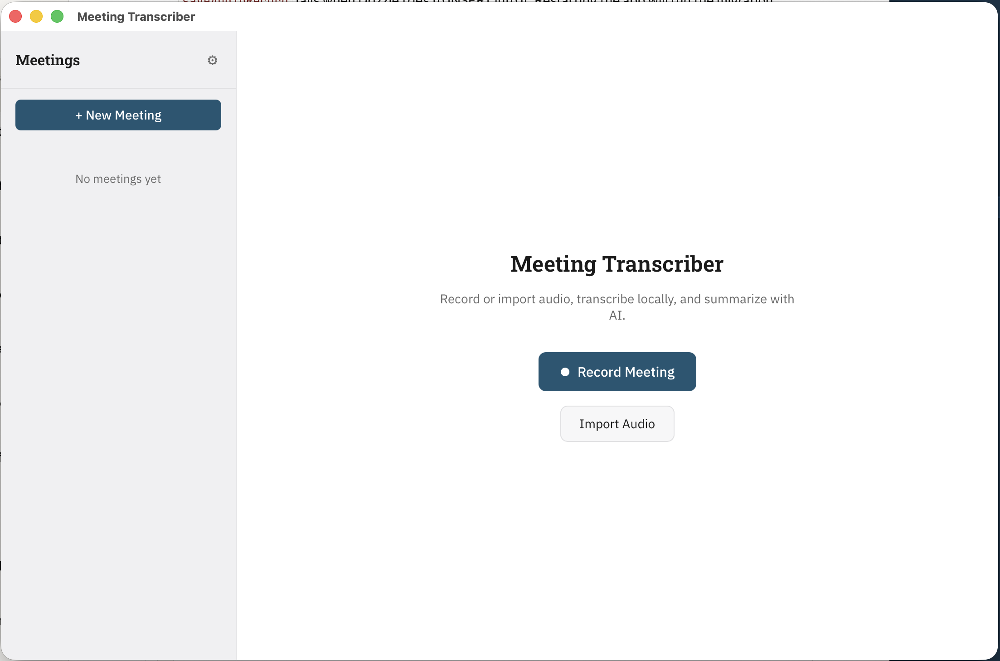

# Meeting Transcriber

A desktop app for recording, transcribing, and summarizing meetings. Transcription runs locally via Whisper, and summaries are generated with the Claude API.



## Prerequisites

- [Bun](https://bun.sh) — runtime and package manager
- [Rust](https://rustup.rs) — for the Tauri backend
- [Tauri v2 system dependencies](https://v2.tauri.app/start/prerequisites/) — platform-specific build tools

## Setup

```sh
bun install
bun tauri dev
```

## Build

```sh
bun tauri build
```

## Scripts

| Command | Description |
|---------|-------------|
| `bun tauri dev` | Run the full app (Vite + Tauri) |
| `bun tauri build` | Production build |
| `bun run dev` | Vite dev server only (no Tauri shell) |
| `bun run tsc --noEmit` | Type check |
| `bun run db:new-migration <name>` | Create a new numbered SQL migration |

## Tech Stack

- **Tauri v2 / Rust** — native desktop shell, file system access, audio processing
- **React 19** — UI
- **Vite** — bundler and dev server
- **PGlite** — in-browser PostgreSQL (IndexedDB-backed)
- **Drizzle ORM** — typed database queries and schema
- **whisper-rs** — local speech-to-text transcription
- **Claude API** — meeting summarization
